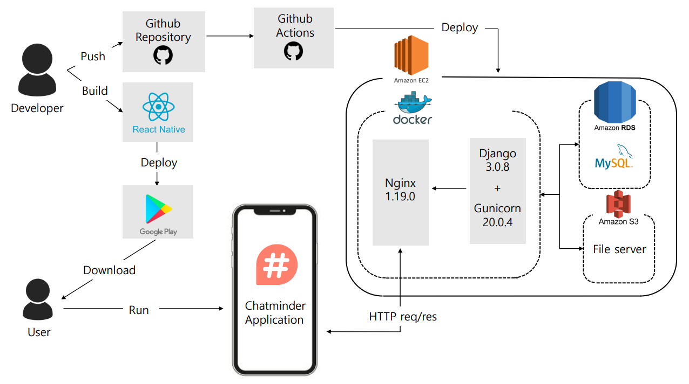
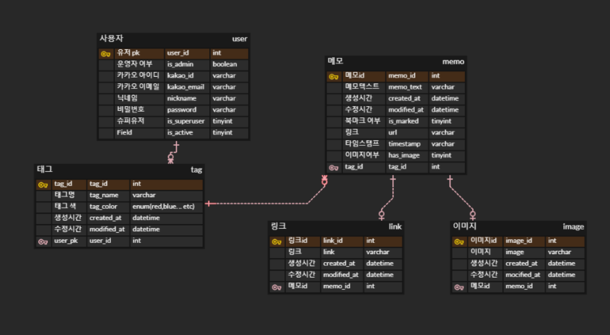

#  Chatminder-Server 
<div align="center">
  
  <br><br>
</div>

## 📢 팀원 소개
 
|                         |                                                         |                        | |
| :----------------------------------------------------------------------------: | :------------------------------------------------------------------------------------------------------------: | :----------------------------------------------------------------------------: | :----------------------------------------------------------------------------: |
|                                     유시원                                     |                                                     이로움                                                     |                                     김채리                                     |                 유준환                     |
|               <a href ="https://github.com/SEEWON">@seewon</a>                |                <a href ="https://github.com/ROUM02">@ROUM02</a>                                              |               <a href ="https://github.com/chaeri93">@chaeri93</a>               |   <a href ="https://github.com/ujunhwan">@ujunhwan</a>|
|                                   프론트엔드                                   |                                                     프론트엔드                                                     |                                     백엔드                                     |             백엔드


## 📑 API 명세서


### [API Document link ](https://documenter.getpostman.com/view/14842658/UVXbvfn6)


## 🔒 개발 아키텍처




## ⚒ 기술 스택

| **Section**       | Tech        |
| ---------------- | ---------------------------- |
| **인프라**       | Docker, Github action        |
| **언어**         | Python                       |
| **프레임워크**   | Django 3.0.8                |
| **데이터베이스** | MySQL, RDS, S3               |
| **웹 서버**      | EC2, Nginx, gunicorn, Django |


## 📂 폴더 구조

```
ChatMinder-Server
│
└───app(앱)
│
└───server
│   │   __init__.py
│   │   asgi.py
│   │   urls.py
│   │   wsgi.py
│   │
│   └───settings
│           __init__.py
│           base.py
│           dev.py
│           prod.py
│
└───config
│   │
│   └───docker
│   │       entrypoint.prod.sh
│   │
│   └───nginx
│   │       Dockerfile
│   │       nginx.conf
│   │
│   └───scripts
│           deploy.sh
│
└───docker-compose.prod.yml
└───Dockerfile.prod
└───manage.py
└───README.md
└───requirements.txt

```


## ✨상세 역할분담
### 준환
- [x] 카카오 로그인
- [x] 회원 가입 및 아이디 중복 확인
- [x] 이미지 저장
- [x] 서버 배포 및 관리

### 채리
- [x] 태그 관련 api 
- [x] 메모 관련 api
- [x] 북마크 관련 api
- [x] 이미지/링크/텍스트 모아보기


## 🎇 ERD



